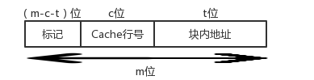
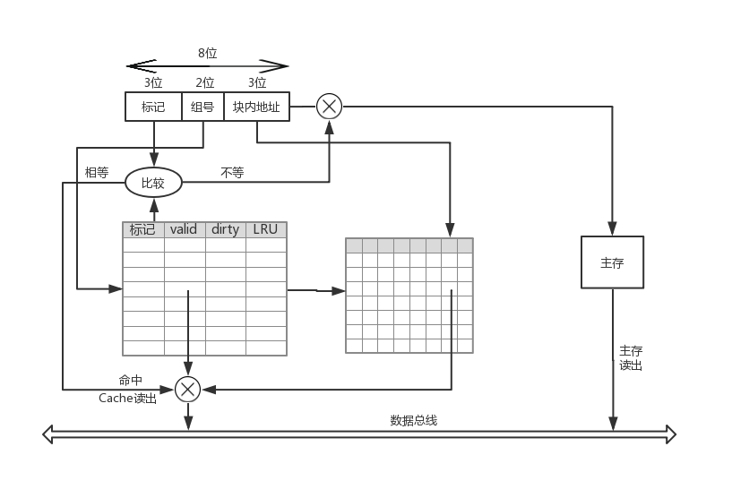

# <center>Cache实验报告</center>

<center>罗翔</center>

<center>17307130191</center>

[TOC]

## 1 Cache简介

### 1.1 局部性原理

　　在较短时间间隔内，程序产生的地址往往集中在存储器的一个很小范围内，这种现象称为局部性，可细分为时间局部性和空间局部性。

- 时间局部性指被访问的某个存储单元在一个较短时间间隔内很可能又被访问。
- 空间局部性指被访问的某个存储单元的临近单元在一个较短时间间隔内很可能被访问。

　　因为程序是由指令和数据组成的，所以出现局部性的原因也可以从这两方面解释。

- 指令在主存中按序存放，地址连续，而程序中的循环程序段或子程序段通常会被重复执行，因此指令访问具有明显的局部性。
- 数据在主存中一般也是连续存放，尤其是数组元素，经常被按序重复访问，因此数据访问也具有明显的局部性。

### 1.2 Cache基本工作原理

　　Cache是一种小容量高速缓冲存储器，在CPU和主存之间设置Cache可以将主存中被频繁访问的程序块和数据块复制到Cache中。利用局部性原理，大多数情况下，CPU能直接从Cache中取得指令和数据，而不必访问主存。

　　CPU在Cache中的访问过程如下图：

<div align="center">
    
    <p style="font-weight:bold; margin-top:0; margin-bottom:0">
        Figure 1
    </p>
</div>
　　因为访问Cache和访问主存所需要的平均访问时间差距巨大，所以需要通过合理的设计Cache和主存的映射关系以及Cache的替换策略以使得访问Cache尽可能地命中。

### 1.3 Cache和主存的映射关系

　　将主存块复制到Cache行时，主存块和Cache行之间必须遵循一定的映射规则，当CPU要访问某个主存单元时，可以依据映射规则，到Cache对应的行中查找要访问的内容。Cache和主存块之间有三种映射方式。

- 直接(Direct)映射：每个主存块映射到Cache的固定行。
- 全相联(Full Associate)映射：每个主存块映射到Cache的任意行。
- 组相联(Set Associate)映射：每个主存块映射到Cache的固定组的任意行。

#### 1.3.1 直接映射

　　直接映射是指将主存的每一块映射到固定的一个Cache行，也称模映射。其映射关系为：
$$
Cache行号 = 主存块号 \mod Cache行数
$$
　　通常Cache的行数是2的幂次，假设主存地址为m位，其中最后的t位为块内地址偏移量，中间c位为Cache的行号，剩下的m-c-t位为对应Cache行的标记位，则主存地址被分成以下三个字段：

<div align="center">
    
    <p style="font-weight:bold; margin-top:0; margin-bottom:0">
        Figure 2
    </p>
</div>
Cache与主存间的映射关系如下：

<div align="center">
    
    <p style="font-weight:bold; margin-top:0; margin-bottom:0">
        Figure 3
    </p>
</div>

#### 1.3.2 全相联映射

　　全相联映射是指一个主存块可以映射到Cache中的任意一行，因此主存地址中无须Cache行索引，只有标记位和Cache行号两个字段：

<div align="center">
    
    <p style="font-weight:bold; margin-top:0; margin-bottom:0">
        Figure 4
    </p>
</div>
　　只要Cache中有空闲行，就不会发生冲突，因而冲突的概率极低；但因为主存块可能在任意一行，所以查找时需要比较所有Cache行的标记，当Cache容量较大时，硬件开销会非常大。

#### 1.3.3 组相联映射

　　组相联映射是指一个主存块可以映射到Cache中固定组的任意一行，引入组相联映射的原因是考虑到直接映射时“同余”的内存块只能映射到同一行，因而会产生频繁的替换以及较高的访问缺失率；而全相联时虽然内存块可以映射到任意一行以减少冲突的概率，但硬件开销过大，因此可以适当增加“同余”块的映射空间在减少冲突的同时保证复杂度不会太大。组相联映射的主存地址编码方式与直接映射的编码方式相同。

　　在实验中我设计了一个2路组相联的iCache和dCache，我将在部件分析中详细讲解。

## 2 部件分析

### 2.1 Cache硬件设计

　　我首先设计了一个4组的2路组相联iCache和dCache，其中每一行中有8个字(4 bytes)，具体如下：

<div align="center">
    
    <p style="font-weight:bold; margin-top:0; margin-bottom:0">
        Figure 5
    </p>
</div>
　　当Cache得到一个Mem地址并确认是访存指令时，首先根据地址的[4:3]判断出访问的数据单元所在内存块映射到Cache哪一个组中，然后查Cachetable中对应组中每行的[2:0]（Tag字段），如果Tag字段与Mem地址的[7:5]匹配并且Cachetable中对应行的Valid位为1时则Hit，从Cachedata对应行中根据内存地址的[2:0]（块内地址偏移量）取出数据；若Cachetable对应组中两行的Tag字段均不能与Mem地址[7:5]匹配或匹配上的行Valid位为0则Miss。

　　Miss时则需要从Mem中读出数据单元所在Mem块（相邻的8个字），如果Cachetable对应组中存在一行的Valid位为0则为空闲行，直接将读出的Mem块写入；如果Cachetable对应组中不存在空闲行，则需要替换策略，在最开始的设计中，为简化设计我将最近一次访问该组时没有访问的一行替换，即每一次访问任意组中一行时都将这一行优先级置为1，组中另一行置为0，每次替换时将优先级为0的替换掉。当需要替换某一行时，还需要查Cachetable中对应行的Dirty位如果为1则需要将这一行写回Mem，如果为0则直接用Mem读出的块覆盖。

　　在进一步的优化中，我将dCache设计为由参数控制的组相联形式，包括以下参数：SET，LINE，OFFSET。其中SET，OFFSET表示Mem地址中组号，块内地址偏移量的字段位数，LINE则表示每一组中的行数，因为我的Mem地址位数为8，所以OFFSET和SET和应不超过8。并且我借鉴了LRU中的老化算法，将Cachetable中LRU位扩充为4位以记录最近4次状态。每当访问Cache中一个组时，组内所有行的LRU状态均逻辑右移1位，并将当前访问行的LRU首位置为1。替换时，首先将每一行的LRU状态中1的数目累加表示最近4次访问该组时每一行被访问的次数，如果相同则直接比较LRU状态位的大小（越近被访问则LRU状态位越大）以决定被替换的行。替换后，将该行的LRU状态位置为4'b1000。

　　两个版本的dCache分别对应dcache.v和dcache_v.v文件。

### 2.2 Cache运行机制

#### 2.2.1 Cache时序设计

　　当Cache命中时，则一个时钟周期就可以获得对应的数据单元，否则则需要从Mem中读出内存块。在实践中我设计了一个有限状态机（FSM）来模拟该过程：

<div align="center">
    
    <p style="font-weight:bold; margin-top:0; margin-bottom:0">
        Figure 6
    </p>
</div>
　　如果当前指令需要访存并且Miss，此时需要从cachefetch状态跳转至waiting_1，时钟上升沿到来时再跳转至waiting_2，memfetch。memfetch阶段完成对应cachetable，cachedata的更新。再一次跳转至cachefetch时从Cache中读出相应数据。

　　Cache从Mem中读出的数据写回是在memfetch阶段完成后（cachefetch的上升沿），如果rhit、whit等信号的更新和数据的更新在同一个always模块中，则rhit信号在时钟上升沿更新时数据块还没有到位，因此应该将信号和数据分离，大致逻辑如下：

```
always@(posedge clk)
	refresh table/block
always@(negedge clk)
	refresh signal
	get data
```

因为信号只需要在cachefetch阶段确定以告诉流水线下一个时钟周期是stall还是正常运行，同样如果需要读出数据也只需要在下一个时钟上升沿到来前稳定读出的数据即可（如果读数据和更新数据在同一个模块，那么每次更新前后读出数据都有延后），所以均可以在一个时钟周期的下降沿再更新。

#### 2.2.2 Cache与流水线交互

　　当Cache命中时，流水线正常运行；而当Cache访问缺失时，外部流水线也应该做相应调整。以下我分为iCache和dCache两部分说明。

##### 2.2.2.1 iCache

　　因为流水线每个时钟上升沿Fetch都需要从iCache中读出下一条指令，所以不需要额外引入使能信号。当访问缺失时，iCache向流水线发出waitinstr信号，流水线接收到信号后使Fetch阶段stall掉并且向Decode阶段插入气泡。这样设计是希望iCache访问缺失时只会影响Fetch，Decode阶段，后续阶段不受影响可以继续运行，但实际上这样设计使得后面的控制逻辑更加麻烦而对于流水线的实际吞吐率并没有任何提升，并且引入dCache后控制逻辑也会产生问题，我将在dCache中说明，对相关信号做的更改如下：

```
assign stallF = stallD | waitinstr;
assign flushD = (pcsrcD & ~stallD & ~branpredD) | jumpD[0] | jumpD[1] | ret | (~pcsrcD & branpredD & ~stallD) | waitinstr;
```

##### 2.2.2.2 dCache

　　因为dCache只有在访存指令(sw, lw)时才会被访问，所以必须添加额外使能信号：读使能(re)，写使能(we)，分别对应memtoregM和memwriteM信号，否则会使得dCache频繁地无意义调入调出数据块。当dCache访问缺失时，dCache向流水线发出waitdata信号，最开始我只想让Mem之前的流水段（包括Mem）stall，但在跑测试样例时发现因为Writeback和Execute阶段之间有转发逻辑(Forwarding)，且为组合逻辑。如果当前Writeback阶段需要将相应寄存器的值转发回Execute阶段，而访问缺失只让Mem之前的流水段stall，给Writeback阶段插入气泡，则Writeback在下一个时钟上升沿写回对应寄存器，当流水线重新正常运转时Writeback和Execute阶段之间没有了转发逻辑，此时流向ALU的操作数显然是错误的。如果考虑将转发逻辑改成时序信号或保持Writeback的相应值都过于复杂，因此直接将整个流水线全部stall，这对流水线的吞吐率并没有任何影响。因此我在Hazard中加入了stallE，stallM，stallW信号，具体信号实现如下：

```
assign stallW = stallM;
assign stallM = waitdata;
assign stallE = stallM;
assign stallD = lwstallD | branchstallD | stallE;
assign stallF = stallD | waitinstr;
assign flushE = stallD & (~stallE);
```

　　这里需要说明的是flushE信号加入~stallE信号，flushE原本是在Decode阶段检测到Load-use冲突或branch预测失误时为了不将错误的信号流入后续流水线而插入气泡，而当整个流水线都停下来时，如果flushE为真则会使下一周期Execute阶段执行nop指令，显然是错误的。加入stallE，stallM，stallW信号后还需要对Execute，Memory，Writeback阶段的寄存器增加一个使能信号来响应。（由flopr->flopenr，floprc->flopenrc）

　　还需要说明的一个问题是当引入dCache时，如果同时发生dCache和iCache的访问缺失，则dCache会使得整个流水线停滞而iCache则会向Decode阶段插入气泡，流水线恢复后Decode阶段为nop，显然是有问题的，所以需要修改flushD的信号，使得dCache的stall优先级高于iCache的flush优先级，更好的措施是iCache访问缺失时也使整个流水线停下来，这对流水线的吞吐率没有影响。

```
assign flushD = (pcsrcD & ~stallD & ~branpredD) | jumpD[0] | jumpD[1] | ret | (~pcsrcD & branpredD & ~stallD) | waitinstr & ~stallD;
```

## 3 模拟测试

　　我通过张作柏同学的<a style="text-decoration:none;" href="https://github.com/Oxer11/MIPS/tree/master/Assembler/assembler.py">译码器</a>生成了以不同步幅对随机生成数据加和的指令：stride_1，stride_2，stride_4，stride_8，stride_16。其中总共随机生成128个字，而我的dCache大小为4组，每组两行，每行可容纳8个字(4 bytes = 32bits)。以下图片需要解释的是：rhit指读命中，times指未命中的次数，寄存器8为t0，是存储加和结果的寄存器。

　　当以步幅为1遍历Mem并进行加和时，结果如下：

<div align="center">
    
    <p style="font-weight:bold; margin-top:0; margin-bottom:0">
        Figure 7
    </p>
</div>

显然顺序取出Mem中的数据时，指令具有良好的局部性，只有在从一个数据块到另一个数据块时才会出现访问缺失，所以最终一共缺失了128/8=16=0x10次。

　　当以步幅为２遍历Mem并进行加和时，结果如下：

<div align="center">
    
    <p style="font-weight:bold; margin-top:0; margin-bottom:0">
        Figure 8
    </p>
</div>

当以步幅为2遍历Mem时，取出的一个数据块只有4个命中，所以总共缺失了128/4=32=0x20次，并且对比上图可知程序因为更多的Miss使得I/O增加运行时间增长。

　　当以步幅为4遍历Mem并进行加和时，结果如下：

<div align="center">
    
    <p style="font-weight:bold; margin-top:0; margin-bottom:0">
        Figure 9
    </p>
</div>

　　当以步幅为8遍历Mem并进行加和时，结果如下：

<div align="center">
    
    <p style="font-weight:bold; margin-top:0; margin-bottom:0">
        Figure 10
    </p>
</div>

　　当以步幅为16遍历Mem并进行加和时，结果如下：

<div align="center">
    
    <p style="font-weight:bold; margin-top:0; margin-bottom:0">
        Figure 11
    </p>
</div>

　　具体测试代码见<a style="text-decoration:none;" href="https://github.com/SunflowerAries/MIPS/tree/master/example">我的Github</a>。

## 4 锁的实现

　　本来我希望在流水线中引入多线程为并发操作提供硬件支持，后来发现MIPS中多线程的实现需要OS的调度以及C库的软件支持，并且MIPS中出现exception时需要繁琐的压栈处理。因此与老师讨论后，我决定通过jal，jr等指令简单模拟多线程的切换(测试样例因时间原因暂时没有构造出来，我会在考试结束后将样例放在<a style="text-decoration:none;" href="https://github.com/SunflowerAries/MIPS/tree/master/example">我的Github上</a>)。实际上，多线程的引入是为了提高CPU的效率，当程序需要进行I/O操作时，为了减少CPU空闲，可以将CPU切换到另一个任务(线程)执行。

　　多线程执行时的一个关键是共享变量的一致性问题：即当多个程序对缓存中的同一单元读写时，不同的执行过程可能得到不同的结果。一个办法是对缓存中的该单元加锁：当一个线程对一个单元更新时，需要保证在他从该单元读出数据进行相应运算并最终更新该单元的过程中没有其他线程对该单元进行更新，即满足原子性。MIPS指令集提供了两条指令来实现锁的机制：LL(Load linked word)、SC(store conditional)。

　　下面结合Youbute上台湾国立云林科技大学的朱宗贤老师给出的样例进行说明。下述指令中，需要比较从0(\$a1)中读出的\$t0与\$a2的值的大小，并将大的结果写回0(\$a1)中，显然当只有一个线程执行时，结果是正确的；但如果有两个线程时，因为不同的线程共享内存，但有不同的寄存器组，假设从0(\$a1)中读出存入\$t0的值为0，Processor 1中\$a2的值为3，Processor 2中\$a2的值为2，则最终写入0(\$a1)的为2，但如果串行执行时显然结果应该为3。原因在于并行执行时，Processor 2在写入时不知道Processor 1已经对0(\$a1)中的值进行了修改。

```
		Processor 1									Processor 2
	try: lw $t0, 0($a1)
    	 slt $t1, $t0, $a2						try: lw $t0, 0($a1)
		 beqz $t1, skip								 slt $t1, $t0, $a2
		 sw $a2, 0($a1)							     beqz $t1, skip
	skip:								 			 sw $a2, 0($a1)
		 										skip:
```

LL，SW指令的形式如下：

```
    LL rt, offset($reg)
    SW rt, offset($reg)
```

　　LL指令与LW指令的区别就是需要额外记录一些读出数据的信息(如读出数据的地址或作为基地址的寄存器)，SC指令与SW指令的区别就是当写入数据时需要先判断在LL与SC指令之间是否有其他线程更新该内存单元，如果没有则将寄存器rt中的值写入内存并将rt置为1(写入成功)，否则不写入内存并且将rt置为0(写入失败)。

　　考虑到一个线程可能申请多个锁，所以维护一个表来记录信息是最合适的，但我做了简化——即假设不会同时存在多个锁并且多个线程只能竞争同一个内存单元，因此我只需要记录是否有锁即可。当处理LL指令时除了像LW指令一样从内存中读出数据还需要在Decode阶段regfile中加锁，即置lock为1(如果需要维护表，则还需记录作为基地址的寄存器)。当处理SC指令时，还需要对寄存器rt赋值，因此可能会涉及转发逻辑，还需要设置写寄存器信号。SC指令在Memory阶段更新内存时需要判断此时是否有锁(lock ?= 1)，有锁则没有其他线程更新内存，将rt中的结果写入内存并解除锁(lock置为0，将aluout置为1)；没有锁则其他线程已经更新过内存，因此需要从内存中读出新的值进行相关操作再更新内存，此时将aluout置为0。

　　下面来看一下上述样例的加锁版本，Processor 1在准备更新内存时发现此时lock为1，表示没有其他线程对内存做了更新，因此将\$t0写入内存，Processor 2准备更新内存时发现此时锁已经解除，所以更新失败，\$t0被置为0，Processor 2跳转至try，重新从内存中读出新的值进行相应操作，显然一致性得到了保证。

```
		Processor 1									Processor 2
	try: ll $t0, 0($a1)
    	 slt $t1, $t0, $a2						try: ll $t0, 0($a1)
		 beqz $t1, skip								 slt $t1, $t0, $a2
		 mov $to, $a2								 beqz $t1, skip
		 sc $t0, 0($a1)								 mov $to, $a2
		 beqz $t0, try								 sc $t0, 0($a1)
    skip:	 									     beqz $t0, try
		 										skip:
```

## 5 申A理由

1. 构造测试样例：stride_1，stride_2，stride_4，stride_8，stride_16，bubble sort来测试Cache效果。
2. 帮助多名同学debug以完成Cache的设计。
3. 完成了iCache，dCache的设计，其中dCache支持动态调节参数，并且Cache（经过大量调整）与上一阶段的动态预测机制BPB适配良好。
4. 报告中除Figure 3以外图片均为自己绘制以加深理解。
5. 加入LL、SC指令实现了简单的锁。

## 6 致谢

1. 非常感谢张作柏同学无私贡献出<a style="text-decoration:none;" href="https://github.com/Oxer11/MIPS/tree/master/Assembler/assembler.py">译码器</a>使得生成测试样例的效率极大提高。
2. Mitu Raj等人就latch问题在<a style="text-decoration:none;" href="https://electronics.stackexchange.com/questions/343146/how-do-i-eliminate-latches-in-fsm-verilog-implementation">StackExchange</a>上的讨论给我提供了很多帮助。
3. 袁春风著的《计算机组成与系统结构》为我的报告内容提供了框架思路并且我还参考了书中的表述方式，引用了书中的图片：Figure 3。
4. 非常感谢台湾国立云林科技大学的朱宗贤老师在Youtube上<a style="text-decoration:none;" href="https://www.youtube.com/watch?v=QPpTBjf4Yrk">对LL和SC指令的讲解</a>


## 7 参考文献

1. 袁春风. 计算机组成与系统结构
2. Randal E. Bryant, David R. O’Hallaron. Computer Systems: A Programmer’s Perspective

