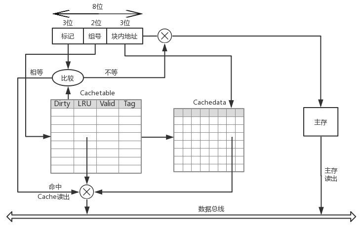

# <center>Cache实验报告</center>

<center>罗翔</center>

<center>17307130191</center>

[TOC]

## 1 Cache简介

### 1.1 局部性原理

　　在较短时间间隔内，程序产生的地址往往集中在存储器的一个很小范围内，这种现象称为局部性，可细分为时间局部性和空间局部性。

- 时间局部性指被访问的某个存储单元在一个较短时间间隔内很可能又被访问。
- 空间局部性指被访问的某个存储单元的临近单元在一个较短时间间隔内很可能被访问。

　　因为程序是由指令和数据组成的，所以出现局部性的原因也可以从这两方面解释。

- 指令在主存中按序存放，地址连续，而程序中的循环程序段或子程序段通常会被重复执行，因此指令访问具有明显的局部性。
- 数据在主存中一般也是连续存放，尤其是数组元素，经常被按序重复访问，因此数据访问也具有明显的局部性。

### 1.2 Cache基本工作原理

　　Cache是一种小容量高速缓冲存储器，在CPU和主存之间设置Cache可以将主存中被频繁访问的程序块和数据块复制到Cache中。利用局部性原理，大多数情况下，CPU能直接从Cache中取得指令和数据，而不必访问主存。

　　CPU在Cache中的访问过程如下图：

<div align="center">
    
    <p style="font-weight:bold; margin-top:0; margin-bottom:0">
        Figure 1
    </p>
</div>
　　因为访问Cache和访问主存所需要的平均访问时间差距巨大，所以需要通过合理的设计Cache和主存的映射关系以及Cache的替换策略以使得访问Cache尽可能地命中。

### 1.3 Cache和主存的映射关系

　　将主存块复制到Cache行时，主存块和Cache行之间必须遵循一定的映射规则，当CPU要访问某个主存单元时，可以依据映射规则，到Cache对应的行中查找要访问的内容。Cache和主存块之间有三种映射方式。

- 直接(Direct)映射：每个主存块映射到Cache的固定行。
- 全相联(Full Associate)映射：每个主存块映射到Cache的任意行。
- 组相联(Set Associate)映射：每个主存块映射到Cache的固定组的任意行。

#### 1.3.1 直接映射

　　直接映射是指将主存的每一块映射到固定的一个Cache行，也称模映射。其映射关系为：
$$
Cache行号 = 主存块号 \mod Cache行数
$$
　　通常Cache的行数是2的幂次，假设主存地址为m位，其中最后的t位为块内地址偏移量，中间c位为Cache的行号，剩下的m-c-t位为对应Cache行的标记位，则主存地址被分成以下三个字段：

<div align="center">
    
    <p style="font-weight:bold; margin-top:0; margin-bottom:0">
        Figure 2
    </p>
</div>
Cache与主存间的映射关系如下：

<div align="center">
    
    <p style="font-weight:bold; margin-top:0; margin-bottom:0">
        Figure 3
    </p>
</div>

#### 1.3.2 全相联映射

　　全相联映射是指一个主存块可以映射到Cache中的任意一行，因此主存地址中无须Cache行索引，只有标记位和Cache行号两个字段：

<div align="center">
    
    <p style="font-weight:bold; margin-top:0; margin-bottom:0">
        Figure 4
    </p>
</div>
　　只要Cache中有空闲行，就不会发生冲突，因而冲突的概率极低；但因为主存块可能在任意一行，所以查找时需要比较所有Cache行的标记，当Cache容量较大时，硬件开销会非常大。

#### 1.3.3 组相联映射

　　组相联映射是指一个主存块可以映射到Cache中固定组的任意一行，引入组相联映射的原因是考虑到直接映射时“同余”的内存块只能映射到同一行，因而会产生频繁的替换以及较高的访问缺失率；而全相联时虽然内存块可以映射到任意一行以减少冲突的概率，但硬件开销过大，因此可以适当增加“同余”块的映射空间在减少冲突的同时保证复杂度不会太大。组相联映射的主存地址编码方式与直接映射的编码方式相同。

　　在实验中我设计了一个2路组相联的iCache和dCache，我将在部件分析中详细讲解。

## 2 部件分析

### 2.1 Cache硬件设计

　　我首先设计了一个4组的2路组相联iCache和dCache，其中每一行中有8个数据(4 bytes)，具体如下：

<div align="center">
    
    <p style="font-weight:bold; margin-top:0; margin-bottom:0">
        Figure 5
    </p>
</div>
　　当Cache得到一个Mem地址并确认是访存指令时，首先根据地址的[4:3]判断出访问的数据单元所在内存块映射到Cache哪一个组中，然后查Cachetable中对应组中每行的[2:0]（Tag字段），如果Tag字段与Mem地址的[7:5]匹配并且Cachetable中对应行的Valid位为1时则Hit，从Cachedata对应行中根据内存地址的[2:0]（块内地址偏移量）取出数据；若Cachetable对应组中两行的Tag字段均不能与Mem地址[7:5]匹配或匹配上的行Valid位为0则Miss。

　　Miss时则需要从Mem中读出数据单元所在Mem块（相邻的8个数据），如果Cachetable对应组中存在一行的Valid位为0则为空闲行，直接将读出的Mem块写入；如果Cachetable对应组中不存在空闲行，则需要替换策略，在最开始的设计中，为简化设计我将最近一次访问该组时没有访问的一行替换，即每一次访问任意组中一行时都将这一行优先级置为1，组中另一行置为0，每次替换时将优先级为0的替换掉。当需要替换某一行时，还需要查Cachetable中对应行的Dirty位如果为1则需要将这一行写回Mem，如果为0则直接用Mem读出的块覆盖。

　　在进一步的优化中，我将dCache设计为由参数控制的组相联形式，包括以下参数：SET，LINE，OFFSET。其中SET，OFFSET表示Mem地址中组号，块内地址偏移量的字段位数，LINE则表示每一组中的行数，因为我的Mem地址位数为8，所以OFFSET和SET和应不超过8。并且我借鉴了LRU中的老化算法，将Cachetable中LRU位扩充为4位以记录最近4次状态。每当访问Cache中一个组时，组内所有行的LRU状态均逻辑右移1位，并将当前访问行的LRU首位置为1。替换时，首先将每一行的LRU状态中1的数目累加表示最近4次访问该组时每一行被访问的次数，如果相同则直接比较LRU状态位的大小（越近被访问则LRU状态位越大）以决定被替换的行。替换后，将该行的LRU状态位置为4'b1000。

　　两个版本的dCache分别对应dcache.v和dcache_v.v文件。

### 2.2 Cache运行机制

#### 2.2.1 Cache状态机设计

　　当Cache命中时，则一个时钟周期就可以获得对应的数据单元，否则则需要从Mem中读出内存块。在实践中我设计了一个有限状态机（FSM）来模拟该过程：

<div align="center">
    
    <p style="font-weight:bold; margin-top:0; margin-bottom:0">
        Figure 6
    </p>
</div>
　　如果当前指令需要访存并且Miss，此时需要从cachefetch状态跳转至waiting_1，时钟上升沿到来时再跳转至waiting_2，memfetch。memfetch阶段完成对应cachetable，cachedata的更新。再一次跳转至cachefetch时从Cache中读出相应数据。

#### 2.2.2 Cache与流水线交互

　　当Cache命中时，流水线正常运行；而当Cache访问缺失时，外部流水线也应该做相应调整。以下我分为iCache和dCache两部分说明。

##### 2.2.2.1 iCache

　　因为流水线每个时钟上升沿Fetch都需要从iCache中读出下一条指令，所以不需要额外引入使能信号。当访问缺失时，iCache向流水线发出waitinstr信号，流水线接收到信号后使Fetch阶段stall掉并且向Decode阶段插入气泡。这样设计是希望iCache访问缺失时只会影响Fetch，Decode阶段，后续阶段不受影响可以继续运行，但实际上这样设计使得后面的控制逻辑更加麻烦而对于流水线的实际吞吐率并没有任何提升，并且引入dCache后控制逻辑也会产生问题，我将在dCache中说明，对相关信号做的更改如下：

```
assign stallF = stallD | waitinstr;
assign flushD = (pcsrcD & ~stallD & ~branpredD) | jumpD[0] | jumpD[1] | ret | (~pcsrcD & branpredD & ~stallD) | waitinstr;
```

##### 2.2.2.2 dCache

　　因为dCache只有在访存指令(sw, lw)时才会被访问，所以必须添加额外使能信号：读使能(re)，写使能(we)，分别对应memtoregM和memwriteM信号，否则会使得dCache频繁地无意义调入调出数据块。当dCache访问缺失时，dCache向流水线发出waitdata信号，最开始我只想让Mem之前的流水段（包括Mem）stall，但在跑测试样例时发现因为Writeback和Execute阶段之间有转发逻辑(Forwarding)，且为组合逻辑。如果当前Writeback阶段需要将相应寄存器的值转发回Execute阶段，而访问缺失只让Mem之前的流水段stall，给Writeback阶段插入气泡，则Writeback在下一个时钟上升沿写回对应寄存器，当流水线重新正常运转时Writeback和Execute阶段之间没有了转发逻辑，此时流向ALU的操作数显然是错误的。如果考虑将转发逻辑改成时序信号或保持Writeback的相应值都过于复杂，因此直接将整个流水线全部stall，这对流水线的吞吐率并没有任何影响。因此我在Hazard中加入了stallE，stallM，stallW信号，具体信号实现如下：

```
assign stallW = stallM;
assign stallM = waitdata;
assign stallE = stallM;
assign stallD = lwstallD | branchstallD | stallE;
assign stallF = stallD | waitinstr;
assign flushE = stallD & (~stallE);
```

　　这里需要说明的是flushE信号加入~stallE信号，flushE原本是在Decode阶段检测到Load-use冲突或branch预测失误时为了不将错误的信号流入后续流水线而插入气泡，而当整个流水线都停下来时，如果flushE为真则会使下一周期Execute阶段执行nop指令，显然是错误的。加入stallE，stallM，stallW信号后还需要对Execute，Memory，Writeback阶段的寄存器增加一个使能信号来响应。（由flopr->flopenr，floprc->flopenrc）

　　还需要说明的一个问题是当引入dCache时，如果同时发生dCache和iCache的访问缺失，则dCache会使得整个流水线停滞而iCache则会向Decode阶段插入气泡，流水线恢复后Decode阶段为nop，显然是有问题的，所以需要修改flushD的信号，使得dCache的stall优先级高于iCache的flush优先级，更好的措施是iCache访问缺失时也使整个流水线停下来，这对流水线的吞吐率没有影响。

```
assign flushD = (pcsrcD & ~stallD & ~branpredD) | jumpD[0] | jumpD[1] | ret | (~pcsrcD & branpredD & ~stallD) | waitinstr & ~stallD;
```

## 3 模拟测试

　　我通过张作柏同学的<a style="text-decoration:none;" href="https://github.com/Oxer11/MIPS/tree/master/Assembler/assembler.py">译码器</a>生成了以不同步幅对随机生成数据加和的指令：stride_1，stride_2，stride_4，stride_8，stride_16。其中总共随机生成128个数据，而我的dCache大小为4组，每组两行，每行可容纳8个数据单元(4 bytes = 32bits)。以下图片需要解释的是：rhit指读命中，times指未命中的次数，寄存器8为t0，是存储加和结果的寄存器。

　　当以步幅为1遍历Mem并进行加和时，结果如下：

<div align="center">
    
    <p style="font-weight:bold; margin-top:0; margin-bottom:0">
        Figure 7
    </p>
</div>

显然顺序取出Mem中的数据时，指令具有良好的局部性，只有在从一个数据块到另一个数据块时才会出现访问缺失，所以最终一共缺失了128/8=16=0x10次。

　　当以步幅为２遍历Mem并进行加和时，结果如下：

<div align="center">
    
    <p style="font-weight:bold; margin-top:0; margin-bottom:0">
        Figure 8
    </p>
</div>

当以步幅为2遍历Mem时，取出的一个数据块只有4个命中，所以总共缺失了128/4=32=0x20次，并且对比上图可知程序因为更多的Miss使得I/O增加运行时间增长。

　　当以步幅为4遍历Mem并进行加和时，结果如下：

<div align="center">
    
    <p style="font-weight:bold; margin-top:0; margin-bottom:0">
        Figure 9
    </p>
</div>

　　当以步幅为8遍历Mem并进行加和时，结果如下：

<div align="center">
    
    <p style="font-weight:bold; margin-top:0; margin-bottom:0">
        Figure 10
    </p>
</div>

　　当以步幅为16遍历Mem并进行加和时，结果如下：

<div align="center">
    
    <p style="font-weight:bold; margin-top:0; margin-bottom:0">
        Figure 11
    </p>
</div>

　　具体测试代码见[附录](#7-附录)。

## 4 申A理由

1. 构造测试样例：stride_1，stride_2，stride_4，stride_8，stride_16来测试Cache效果。
2. 帮助多名同学debug以完成Cache的设计。
3. 完成了iCache，dCache的设计，其中dCache支持动态调节参数，并且Cache（经过大量调整）与上一阶段的动态预测机制BPB适配良好。
4. 报告中除Figure 2以外图片均为自己绘制以加深理解。

## 5 致谢

1. 非常感谢张作柏同学无私贡献出<a style="text-decoration:none;" href="https://github.com/Oxer11/MIPS/tree/master/Assembler/assembler.py">译码器</a>使得生成测试样例的效率极大提高。
2. Mitu Raj等人就latch问题在<a style="text-decoration:none;" href=" https://electronics.stackexchange.com/questions/343146/how-do-i-eliminate-latches-in-fsm-verilog-implementation">StackExchange</a>上的讨论给我提供了很多帮助。
3. 袁春风著的《计算机组成与系统结构》为我的报告内容提供了框架思路并且我还参考了书中的表述方式，引用了书中的图片：Figure 2。

## 6 参考文献

1. 袁春风. 计算机组成与系统结构
2. Randal E. Bryant, David R. O’Hallaron. Computer Systems: A Programmer’s Perspective

## 7 附录

- stride_1

  ```
   0x0 : addi $v0, $0, 0      | 20020000
   0x4 : addi $t0, $0, 0      | 20080000
   0x8 : addi $v1, $0, 512    | 20030200
   0xc : for:                 | 
   0xc : lw $s0, 0($v0)       | 8c500000
  0x10 : add $t0, $t0, $s0    | 01104020
  0x14 : addi $v0, $v0, 4     | 20420004
  0x18 : bne $v0, $v1, for    | 1462fffc
  ```

- stride_2

  ```
   0x0 : addi $v0, $0, 0      | 20020000
   0x4 : addi $t0, $0, 0      | 20080000
   0x8 : addi $v1, $0, 512    | 20030200
   0xc : for:                 | 
   0xc : lw $s0, 0($v0)       | 8c500000
  0x10 : add $t0, $t0, $s0    | 01104020
  0x14 : addi $v0, $v0, 8     | 20420008
  0x18 : bne $v0, $v1, for    | 1462fffc
  0x1c : addi $v0, $0, 4      | 20020004
  0x20 : addi $v1, $0, 516    | 20030204
  0x24 : tar:                 | 
  0x24 : lw $s0, 0($v0)       | 8c500000
  0x28 : add $t0, $t0, $s0    | 01104020
  0x2c : addi $v0, $v0, 8     | 20420008
  0x30 : bne $v0, $v1, tar    | 1462fffc
  ```

- stride_4

  ```
   0x0 : addi $v0, $0, 0      | 20020000
   0x4 : addi $t0, $0, 0      | 20080000
   0x8 : addi $v1, $0, 512    | 20030200
   0xc : for:                 | 
   0xc : lw $s0, 0($v0)       | 8c500000
  0x10 : add $t0, $t0, $s0    | 01104020
  0x14 : addi $v0, $v0, 16    | 20420010
  0x18 : bne $v0, $v1, for    | 1462fffc
  0x1c : addi $v0, $0, 4      | 20020004
  0x20 : addi $v1, $0, 516    | 20030204
  0x24 : tar:                 | 
  0x24 : lw $s0, 0($v0)       | 8c500000
  0x28 : add $t0, $t0, $s0    | 01104020
  0x2c : addi $v0, $v0, 16    | 20420010
  0x30 : bne $v0, $v1, tar    | 1462fffc
  0x34 : addi $v0, $0, 8      | 20020008
  0x38 : addi $v1, $0, 520    | 20030208
  0x3c : nod:                 | 
  0x3c : lw $s0, 0($v0)       | 8c500000
  0x40 : add $t0, $t0, $s0    | 01104020
  0x44 : addi $v0, $v0, 16    | 20420010
  0x48 : bne $v0, $v1, nod    | 1462fffc
  0x4c : addi $v0, $0, 12     | 2002000c
  0x50 : addi $v1, $0, 524    | 2003020c
  0x54 : bai:                 | 
  0x54 : lw $s0, 0($v0)       | 8c500000
  0x58 : add $t0, $t0, $s0    | 01104020
  0x5c : addi $v0, $v0, 16    | 20420010
  0x60 : bne $v0, $v1, bai    | 1462fffc
  ```

- stride_8

  ```
   0x0 : addi $v0, $0, 0      | 20020000
   0x4 : addi $t0, $0, 0      | 20080000
   0x8 : addi $v1, $0, 512    | 20030200
   0xc : for:                 | 
   0xc : lw $s0, 0($v0)       | 8c500000
  0x10 : add $t0, $t0, $s0    | 01104020
  0x14 : addi $v0, $v0, 32    | 20420020
  0x18 : bne $v0, $v1, for    | 1462fffc
  0x1c : addi $v0, $0, 4      | 20020004
  0x20 : addi $v1, $0, 516    | 20030204
  0x24 : tar:                 | 
  0x24 : lw $s0, 0($v0)       | 8c500000
  0x28 : add $t0, $t0, $s0    | 01104020
  0x2c : addi $v0, $v0, 32    | 20420020
  0x30 : bne $v0, $v1, tar    | 1462fffc
  0x34 : addi $v0, $0, 8      | 20020008
  0x38 : addi $v1, $0, 520    | 20030208
  0x3c : nod:                 | 
  0x3c : lw $s0, 0($v0)       | 8c500000
  0x40 : add $t0, $t0, $s0    | 01104020
  0x44 : addi $v0, $v0, 32    | 20420020
  0x48 : bne $v0, $v1, nod    | 1462fffc
  0x4c : addi $v0, $0, 12     | 2002000c
  0x50 : addi $v1, $0, 524    | 2003020c
  0x54 : bai:                 | 
  0x54 : lw $s0, 0($v0)       | 8c500000
  0x58 : add $t0, $t0, $s0    | 01104020
  0x5c : addi $v0, $v0, 32    | 20420020
  0x60 : bne $v0, $v1, bai    | 1462fffc
  0x64 : addi $v0, $0, 16     | 20020010
  0x68 : addi $v1, $0, 528    | 20030210
  0x6c : gayhu:               | 
  0x6c : lw $s0, 0($v0)       | 8c500000
  0x70 : add $t0, $t0, $s0    | 01104020
  0x74 : addi $v0, $v0, 32    | 20420020
  0x78 : bne $v0, $v1, gayhu  | 1462fffc
  0x7c : addi $v0, $0, 20     | 20020014
  0x80 : addi $v1, $0, 532    | 20030214
  0x84 : gayhao:              | 
  0x84 : lw $s0, 0($v0)       | 8c500000
  0x88 : add $t0, $t0, $s0    | 01104020
  0x8c : addi $v0, $v0, 32    | 20420020
  0x90 : bne $v0, $v1, gayhao | 1462fffc
  0x94 : addi $v0, $0, 24     | 20020018
  0x98 : addi $v1, $0, 536    | 20030218
  0x9c : bossxie:             | 
  0x9c : lw $s0, 0($v0)       | 8c500000
  0xa0 : add $t0, $t0, $s0    | 01104020
  0xa4 : addi $v0, $v0, 32    | 20420020
  0xa8 : bne $v0, $v1, bossxie | 1462fffc
  0xac : addi $v0, $0, 28     | 2002001c
  0xb0 : addi $v1, $0, 540    | 2003021c
  0xb4 : erhu:                | 
  0xb4 : lw $s0, 0($v0)       | 8c500000
  0xb8 : add $t0, $t0, $s0    | 01104020
  0xbc : addi $v0, $v0, 32    | 20420020
  0xc0 : bne $v0, $v1, erhu   | 1462fffc
  ```

- stride_16

  ```
   0x0 : addi $v0, $0, 0      | 20020000
   0x4 : addi $t0, $0, 0      | 20080000
   0x8 : addi $v1, $0, 64     | 20030040
   0xc : for:                 | 
   0xc : lw $s0, 0($v0)       | 8c500000
  0x10 : add $t0, $t0, $s0    | 01104020
  0x14 : lw $s0, 64($v0)      | 8c500040
  0x18 : add $t0, $t0, $s0    | 01104020
  0x1c : lw $s0, 128($v0)     | 8c500080
  0x20 : add $t0, $t0, $s0    | 01104020
  0x24 : lw $s0, 192($v0)     | 8c5000c0
  0x28 : add $t0, $t0, $s0    | 01104020
  0x2c : lw $s0, 256($v0)     | 8c500100
  0x30 : add $t0, $t0, $s0    | 01104020
  0x34 : lw $s0, 320($v0)     | 8c500140
  0x38 : add $t0, $t0, $s0    | 01104020
  0x3c : lw $s0, 384($v0)     | 8c500180
  0x40 : add $t0, $t0, $s0    | 01104020
  0x44 : lw $s0, 448($v0)     | 8c5001c0
  0x48 : add $t0, $t0, $s0    | 01104020
  0x4c : addi $v0, $v0, 4     | 20420004
  0x50 : bne $v0, $v1, for    | 1462ffee
  ```

  