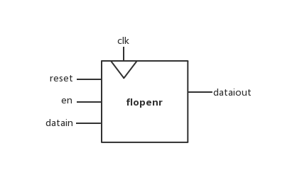

# <center>MIPS流水线实验报告</center>

<center>罗翔</center>

<center>17307130191</center>

[TOC]

## 1 流水线处理器简介

### 1.1 流水线处理器的特征

　　单周期与多周期处理器的指令执行都是采用串行方式，CPU总是在执行完一条指令后才取出下条指令执行；而流水线则通过将多条指令的执行相互重叠起来以提高CPU执行指令的效率。在实现中，流水线由5个流水段组成：

- 取指令 (Fetch)：从cache或主存取指令。
- 指令译码 (Decode)：产生指令执行所需的控制信号并读取寄存器操作数。
- 执行 (Execute)：对操作数完成指定操作。
- 访存 (Memory)：从存储器中读取操作数或者操作数写回存储器。
- 写回 (Writeback)：将操作数写回寄存器。

### 1.2 适合流水线的指令集特征

- 指令长度应尽量一致以有利于简化取指令和指令译码操作。
- 指令格式应尽量规整，尽量保证源寄存器的位置相同以有利于在指令未知时就可以取寄存器操作数。
- 采用装入/存储型指令风格，保证除Lord/Store 指令外的其他指令不能访问存储器以使得Lord/Store指令的地址计算和运算指令的执行步骤规整在同一个周期中。

## 2 部件分析

　　流水线处理器中大部分部件与单周期相似，因此只列出新添加或发生改动的部件。

### 2.1 Hazard

　　在指令流水线中，可能会遇到一些冒险情况，即因为流水线无法正确执行后续指令而引起流水线阻塞或停顿(stall)。参考袁春风的《计算机组成与系统结构》，我将导致冒险的原因分为结构冒险、数据冒险、控制冒险三种。以下分别介绍其对策以及在Hazard中的实现。

#### 2.1.1 结构冒险

　　结构冒险 (Structural Hazards) 也称为硬件资源冲突 (Hardware Resource Conflicts) 。引起结构冒险的原因在于同一个部件同时被不同指令所用。因此我们将在多周期中复用的指令存储器和数据存储器分离以解决读取指令与写回/读取数据时产生的冒险。

#### 2.1.2 数据冒险

　　数据结构 (Data Hazards) 也称为数据相关 (Data Dependencies) 。引起数据冒险的原因在于后面指令用到前面指令结果时前面指令结果还没产生。以下是一个存在数据冒险的流水线例子：

```
    add $1, $2, $3
    sub $4, $1, $3
    or	$8, $1, $9
    add $6, $1, $7
    xor $3, $1, $5
```

　　第1条指令的目的寄存器\$1是后面4条指令的源寄存器。第1条指令在Wr阶段结束才将结果写到\$1中，而第2、3、4条指令分别在第1条指令的Ex、Mem、Wr阶段就要取\$1的内容。

##### 2.1.2.1 转发技术

　　转发 (forwarding) 技术是指将数据通路中生成的中间数据直接转发到ALU的输入端以保证后续指令得到正确的操作数。例如上例中第1条指令在Ex段结束时已经得到\$1的新值，并被存放在Ex/Mem流水线寄存器中。因此在第2条指令执行前可以直接从Ex/Mem中读出数据送到ALU输入端，同样第3条指令执行前也可以直接从Mem/Wr中读出数据。至于第1条指令和第4条指令之间的数据相关问题，可以通过将寄存器写口和读口分别控制在前、后半个时钟周期内解决。

　　发生数据相关的情况由以下两种：

- 当前指令的目的操作数是随后第一条指令所用的源操作数，对应的转发条件的实现：
    ```
        assign forwardaD = (rsD != 0 & rsD == writeregM & regwriteM);
        assign forwardbD = (rtD != 0 & rtD == writeregM & regwriteM);
    ```


- 当前指令的目的操作数是随后第二条指令所用的源操作数，对应的转发条件的实现：

  ```
      if(rsE != 0)
          if(rsE == writeregM & regwriteM) forwardaE = 2'b10;
          else if(rsE == writeregW & regwriteW) forwardaE = 2'b01;
      if(rtE != 0)
          if(rtE == writeregM & regwriteM) forwardbE = 2'b10;
          else if(rtE == writeregW & regwriteW) forwardbE = 2'b01;
  ```

  此处Mem和Wr阶段的判断的顺序不能更改，即Mem中目的操作数的优先级应高于Wr中的目的操作数。以下是一个说明优先级的例子：

  ```
  	add $1, $1, $2
  	add $1, $1, $3
  	add $1, $1, $4
  ```

  显然第3条指令中的源操作数\$1应获得第2条指令中目的操作数\$1的内容。

　　判断中regwrite*不能省略，因为只有当寄存器数据相关且会写回目的寄存器时才需转发，如beq指令虽然可能与随后的指令数据相关但是结果不会写回寄存器所以不需要转发。$Reg \neq 0$的判断同样不能省略，因为MIPS中\$0的值恒为0，但不排除有恶意程序如：

```
	add $0, $7, $8
```

　　使得\$0的结果不为0，此时下条指令的操作数仍应为0。

　　转发技术可以解决相邻两条ALU指令之间、相隔一条的两个ALU指令之间、相隔一条的Load和ALU指令间以及ALU指令后一条为Sw指令之间的数据相关带来的数据冒险问题。

##### 2.1.2.2 Load/use数据冒险的检测和处理

　　但显然Lw指令随后跟的R-型指令或I-型指令的相关性问题无法通过转发来解决，因为Lw指令要在Mem阶段结束后才能得到数据存储器中的结果，然后送到Mem/Wr寄存器中，并在Wr阶段写回寄存器。以下是一个说明的例子：

```
    lw  $1, 0($2)
    sub $4, $1, $3
    or	$8, $1, $9
    add $6, $1, $7
```

　　sub指令在Ex阶段就要取\$1的值，而此时Lw指令还没有更新\$1中的值。

　　在实际中，Load/use冒险可以通过编译优化来调整指令顺序将不相干的指令插入Lw和R-/I-型指令之间来解决，而通过硬件来解决Load/use冒险则需要加入阻塞处理，对应判断逻辑的实现：

```
	assign lwstallD = memtoregE & (rtE == rsD | rtE == rtD);
```

　　即在Decode阶段检测上一条指令(Execute阶段)是否为Lw指令并且数据相关，若相关则为Load/use冒险，此时需要将紧随Load后的两条指令停顿一个时钟周期后继续执行，具体实现为：

- 将ID/Ex流水段寄存器中所有控制信号清0(插入气泡)

- 保持IF/ID流水段寄存器的值不变以使得在下一时钟周期对Load后的第一条指令重新译码/取数

- 保持PC值不变以使得Load后的第二条指令在下一时钟周期重新取指令。

  在Hazard中具体控制信号的实现如下：

    ```
    assign stallD = lwstallD | branchstallD;
    assign stallF = stallD;
    assign flushE = stallD;
    ```

　　在Datapath中阻塞与气泡的具体实现会在Flopr中详细说明，在此先略过。

#### 2.1.3 控制冒险

　　控制冒险(Control Hazards) 是指因指令执行顺序改变而引起的流水线阻塞，在本实现中只考虑了由转移指令引起的控制冒险。以下是一个引起控制冒险的流水线例子：

```
    addi $t0, $0, 10
    addi $s0, $s0, 1
    bne  $s0, $t0, for
    add  $s1, $0, $0
    addi $s0, $0, 0
    for:
    add  $s1, $s1, $s0
```

　　第3条指令bne需要在Execute阶段结束才能判断是否跳转，并在Mem阶段将PC的值更新为目标地址、判断出此时Ex和ID段的第4、5两条指令不该执行，此时需要在Ex、ID阶段插入气泡。

　　而在具体操作时，我们可以将判断是否跳转提前至Decode阶段，通过在译码、取值阶段加入一个专用的比较操作数的部件comp来实现。同样也可能出现跳转指令与以前的指令产生数据相关，此时则需加入阻塞。判断是否产生数据相关在Hazard中的具体控制信号实现如下：

```
assign branchstallD = (branchD[0] | branchD[1]) & ((regwriteE & ((writeregE == rsD) | (writeregE == rtD))) | (memtoregM & ((writeregM == rsD) | (writeregM == rtD))));
```

　　若发现应该跳转，则需插入气泡以清除此时流水线中已经加入的一条顺序取来的指令，判断是否跳转及是否插入气泡在Hazard中的具体控制信号实现如下：

```
assign pcsrcD = (branchD[0] & equalD) | (branchD[1] & (~equalD));
assign flushD = (pcsrcD & ~stallD)
```

　　需要说明的一点是PPT中给的代码省略了~stallD，这是错误的。可能会出现的情况：branch前一条指令与branch指令间存在数据冒险，此时在Decode阶段的branch指令应该stall，而此时comp器件比较得出的pcsrcD为1，显然这个数据应该是无效的。

### 2.2 Flopr及其变型

　　Flopenr设计图如下

<div>
    
</div>


　　Flopr及其变型主要用作寄存器，保存流水线各阶段的数据及信号。以下分寄存器说明：

- /Fetch

  　　　　本寄存器因为涉及到跳转预测，在此只说明基础版本的实现。我们在此采用的是flopenr，用于PC的更新。在时钟上升沿时更新下一条指令的地址，当出现转发无法解决的数据冒险如Load-use或branchstall时，需要Fetch、Decode阶段均stall，此时应通过控制Fetch阶段的stallF信号使PcF保持不变。

- Fetch/Decode

  　　　　在本寄存器中需要保存和更新的数据有pcplus4，instr。其中pcplus4对应的寄存器采用flopenr，在时钟上升沿时使Fetch阶段的pcplus4流向Decode阶段，用于计算跳转地址pcbranch，当出现上述的数据冒险时可通过stallD信号控制使得Decode阶段stall。instr对应的寄存器采用flopenrc，在时钟上升沿时使Fetch阶段从指令寄存器中读出的instrF流向Decode阶段用于译码并生成指令的对应控制信号。flopenrc除了flopenr的几个控制外，在本实例中还需要一个清零的控制flushD用来插入气泡。flushD信号的实现已在控制冒险中说明。

- Decode/Execute

  　　在本寄存器中需要保存和更新的数据有srca，srcb，signimmE，rsE，stE，rdE，shamtE，且均用floprc实现。在时钟上升沿时将对应数据从Decode阶段送到Execute阶段用于ALU的计算以及Write阶段写回寄存器的确定。并且还需要一个清零的控制flushE，控制逻辑与flushD一致。寄存器中还应保存和更新相应的信号，包括Execute阶段会用的alusrc,  alucontrol，Memory阶段会用的memwrite以及Write阶段会用到的regdst, regwrite, memtoreg，也用floprc实现。

- Execute/Memory

  　　本寄存器中需要保存和更新的数据有writedata，aluout，writereg，因为在后续阶段中不涉及插入气泡的问题，所以只需用flopr实现即可。在时钟上升沿时将从寄存器中读出的值从Execute阶段送到Memory阶段以写入内存，其他数据在Write阶段会用到。

- Memory/Write

　　　　本寄存器中需要保存和更新的数据有aluout，writereg，用于寄存器的写回。

### 2.3 Datapath

　　Datapath设计图如下

<div>
    
</div>


　　Datapath中的部件设计与单周期的实现相同，主要的改变是引入了流水线来达到并行的效果，而流水线中每个阶段的寄存器情况已经说明，故不再赘述。Datapath的另一改变是引入了跳转预测机制（Branch Prediction Buffer）来提高CPU的运行效率，我将在下一部分中详细说明。

### 2.4 Branch Prediction Buffer

　　本部分思路借鉴袁春风《计算机组成与系统结构》7.3.3 控制冒险的动态预测。

####　2.4.1 设计初衷

　　在最原始的流水线中当执行branch指令时需要在Execute阶段才能确定是否跳转，如果应该跳转则Fetch、Decode阶段顺序取出的指令都应该被flush，这造成了CPU资源的浪费。虽然我们在Decode阶段引入comp器件将确定跳转提前，但执行跳转时仍然会使Fetch阶段的指令被flush。考虑到现代计算机中跳转指令的使用情况（for、while语句一般会大量循环），我们可以引入一个预测跳转机制，根据上一次跳转指令执行的情况来预测这一次，将判断是否跳转提前到Fetch阶段。这显然可以有效减少气泡数目，并预测错误一般只发生在进入循环语句和退出循环语句。

#### 2.4.2 设计思路

　　预测跳转机制的流程图如下

<div>
    
</div>　　　
　　Fetch阶段从指令存储器中取出指令并且将pcF的后8位送入BHT中查看是否有对应跳转指令的记录，若有，当预测位为1时，读出跳转指令对应的转移目标地址作为下一条指令的地址；当预测位为0时，则判断不跳转顺序读出下一条指令。如果BHT中没有相应跳转指令的记录，则预测不发生跳转，并且在BHT中记录相应跳转指令的信息。以下讨论可能遇见的情况

- 预测跳转，实际跳转
- 预测跳转，实际不跳转
- 预测不跳转，实际不跳转
- 预测不跳转，实际跳转

　　

## 4 添加指令及模拟测试

### 4.1 branpred.in

　　

### 4.2 factorial.in

　　

### 4.3 shift.in

　　

## 5 申A理由

　　

## 6 参考文献

1. 袁春风. 计算机组成与系统结构

2. 除随机测试外，其余所有测试指令皆参考张作柏同学GitHub上的相关测试指令<https://github.com/Oxer11/MIPS/tree/master/Assembler/example>

```
 0x0 : add $s1, $0, $0      | 00008820
 0x4 : addi $s0, $0, 0      | 20100000
 0x8 : addi $t0, $0, 10     | 2008000a
 oxc : for :
 0xc : add $s1, $s1, $s0    | 02308820
0x10 : addi $s0, $s0, 1     | 22100001
0x14 : bne $s0, $t0, for    | 1510fffd
```

